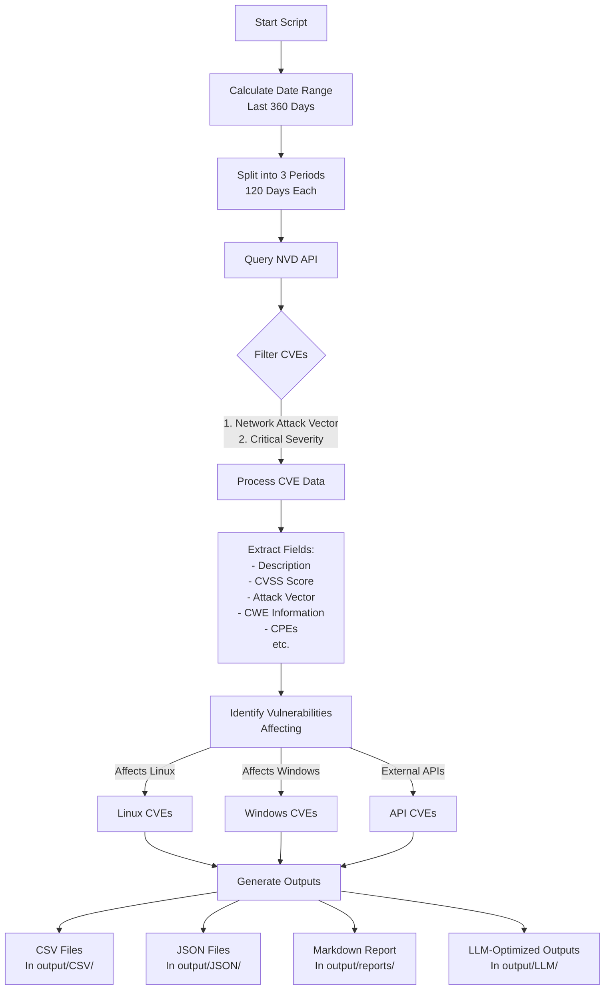

# NVD Vulnerability Extractor

A Python script to extract critical vulnerabilities from the National Vulnerability Database (NVD) API with network attack vectors, and filter them for operating systems and externally facing APIs.

**Author:** Nic Cravino  
**Date:** February 27, 2025

## How It Works



### API Request:
- The base URL is set to the NVD API endpoint: `https://services.nvd.nist.gov/rest/json/cves/2.0`.
- Parameters include the date range, a filter for "CRITICAL" severity, and pagination settings.

### Data Collection:
- The script processes each 120-day period separately, fetching all pages of results.
- For each CVE, the script checks if the attack vector is "NETWORK" (AV:N).
- It extracts:
  - **CVE ID**: Unique identifier (e.g., "CVE-2023-1234").
  - **Description**: English description of the vulnerability.
  - **CVSS Score**: Base score from CVSS v3.1 metrics.
  - **Attack Vector**: How the vulnerability is exploited (filtered for NETWORK).
  - **Attack Complexity**: How difficult the vulnerability is to exploit.
  - **Privileges Required**: Authentication level needed to exploit the vulnerability.
  - **User Interaction**: Whether user interaction is required.
  - **Scope**: Whether the vulnerability affects resources beyond its security scope.
  - **CWE Information**: Common Weakness Enumeration identifiers.
  - **Reference Tags**: Related tags from vulnerability references.
  - **Affects Linux**: Yes/No flag indicating if Linux systems are affected.
  - **Affects Windows**: Yes/No flag indicating if Windows systems are affected.
  - **Likely External API**: Yes/No flag indicating if the vulnerability likely affects external APIs.
  - **Affected CPEs**: List of Common Platform Enumeration URIs for affected systems.

### Filtering and Output:
- **Complete Dataset**: All critical CVEs with network attack vectors are saved to:
  - `output/CSV/critical_cves_YYYY-MM-DD.csv`
  - `output/JSON/critical_cves_YYYY-MM-DD.json`

- **Filtered Datasets**:
  - `output/CSV/filtered_cves_YYYY-MM-DD.csv` and `output/JSON/filtered_cves_YYYY-MM-DD.json`: Vulnerabilities affecting Linux, Windows, or external APIs
  - `output/CSV/linux_cves_YYYY-MM-DD.csv`: Vulnerabilities specifically affecting Linux systems
  - `output/CSV/windows_cves_YYYY-MM-DD.csv`: Vulnerabilities specifically affecting Windows systems
  - `output/CSV/api_cves_YYYY-MM-DD.csv`: Vulnerabilities likely to affect externally facing APIs

### LLM-Optimized Outputs

The script generates special outputs designed specifically for use with Large Language Models (LLMs) like ChatGPT, Claude, or other AI assistants:

- **LLM-Optimized JSON Files**: Located in `output/LLM/` with the naming pattern `*_cves_llm_*.json`
  - Uses shorter field names to reduce token usage
  - Converts string flags to native booleans
  - Includes metadata context (data type, category, description, date range)
  - Optimized for efficient token usage while preserving critical information

- **Ready-to-Use Prompt Templates**: Located in `output/LLM/` with the naming pattern `*_cves_prompt_*.md`
  - Contains embedded JSON data in a code block
  - Includes context about the data (description, count, date range)
  - Provides example prompts for vulnerability analysis
  - Automatically limits to 50 vulnerabilities when needed to fit context windows
  - Sorts vulnerabilities by CVSS score (highest first) to prioritize the most severe issues

These optimized outputs are ideal for:
- Analyzing vulnerability patterns with AI assistants
- Generating security recommendations based on current threat data
- Creating custom prompts for specialized security analysis
- Integrating vulnerability data into AI workflows

### Usage

1. Clone this repository:
   ```bash
   git clone https://github.com/spidernic/NVD-Extractor.git
   cd NVD-Extractor
   ```

2. Install required dependencies:
   ```bash
   pip install -r requirements.txt
   ```

3. Run the script:
   ```bash
   python src/nvd_extraction_v1.py
   ```

4. Check the `output` directory for results:
   - `output/CSV/` contains CSV files with vulnerability data
   - `output/JSON/` contains JSON files with the same data
   - `output/LLM/` contains LLM-optimized outputs and prompt templates
   - `output/reports/` contains execution reports with statistics

5. For LLM analysis:
   - Navigate to the `output/LLM/` directory
   - Open any of the `*_prompt_*.md` files
   - Copy the content into your preferred LLM interface (ChatGPT, Claude, etc.)
   - The LLM will analyze the vulnerability data based on the embedded example prompt

### Output Files

All output files are saved in the `output` directory, with separate subfolders for CSV, JSON, LLM-optimized formats, and reports. Each filename includes the current date in YYYY-MM-DD format.

| File | Format | Description |
|------|--------|-------------|
| `output/CSV/critical_cves_YYYY-MM-DD.csv` | CSV | All critical vulnerabilities with a network attack vector |
| `output/JSON/critical_cves_YYYY-MM-DD.json` | JSON | Same as above, in JSON format |
| `output/CSV/filtered_cves_YYYY-MM-DD.csv` | CSV | Combined set of vulnerabilities affecting Linux, Windows, or external APIs |
| `output/JSON/filtered_cves_YYYY-MM-DD.json` | JSON | Same as above, in JSON format |
| `output/CSV/linux_cves_YYYY-MM-DD.csv` | CSV | Vulnerabilities specifically affecting Linux systems |
| `output/CSV/windows_cves_YYYY-MM-DD.csv` | CSV | Vulnerabilities specifically affecting Windows systems |
| `output/CSV/api_cves_YYYY-MM-DD.csv` | CSV | Vulnerabilities likely to affect externally facing APIs |
| `output/LLM/critical_cves_llm_YYYY-MM-DD.json` | JSON | LLM-optimized format of critical vulnerabilities |
| `output/LLM/critical_cves_prompt_YYYY-MM-DD.md` | Markdown | Ready-to-use prompt template with embedded JSON for LLMs |
| `output/reports/nvd_extraction_report_YYYY-MM-DD_HH-MM-SS.md` | Markdown | Detailed execution report with statistics and summary |

## Error Handling and Rate Limiting:
- Checks for successful API responses (status code 200) and prints errors if they occur.
- Adds delays between requests to respect API rate limits.
- Adds a 5-second delay between period queries to avoid hitting rate limits.

## Filtering Criteria

The script applies these criteria to identify specific vulnerability types:

1. **Linux Vulnerabilities**: CPE strings containing "linux"
2. **Windows Vulnerabilities**: CPE strings containing "windows" 
3. **External API Vulnerabilities**: Vulnerabilities that have:
   - Network attack vector
   - No privileges required
   - Either no user interaction or are input validation related (e.g., CWE-20)

## Example Output

Each output file contains the same fields but filtered for different criteria:

```
CVE ID,Description,CVSS Score,Attack Vector,Attack Complexity,Privileges Required,...
CVE-2024-1234,"A critical vulnerability...",9.8,NETWORK,LOW,NONE,...
```

## Project Structure

```
nvd/
├── src/                  # Source code
│   └── nvd_extraction_v1.py  # Main script
├── archive/              # Archived/deprecated code
├── .gitignore            # Git ignore file
├── requirements.txt      # Project dependencies
├── README.md             # You are here
└── output/               # Generated output files
    ├── CSV/              # CSV format results
    ├── JSON/             # JSON format results
    ├── LLM/              # LLM-optimized outputs and prompts
    └── reports/          # Execution reports and summaries
```

## Installation

```bash
# Clone the repository
git clone https://github.com/spidernic/NVD-Extractor.git

# Navigate to the project directory
cd NVD-Extractor

# Install dependencies
pip install -r requirements.txt
```

## Notes

- The script assumes internet access and NVD API availability.
- You can modify parameters (e.g., change severity or adjust the date range) to suit different needs.
- All output files are saved in the script's working directory.

## Future Enhancements

The following enhancements are planned for future versions:

- **Web-based GUI**: Create a simple web interface for the tool to make it more accessible to users without programming experience.
- **Enhanced Logging**: Implement more detailed logging for better troubleshooting and audit trails.
- **Customizable Filters**: Allow more user-defined filters for vulnerability types, affected products, and more.
- **Export to Additional Formats**: Add support for exporting to other formats like HTML or PDF.
- **Authentication**: Add support for NVD API key authentication for higher rate limits.
- **Trend Analysis**: Add functionality to compare data over time and identify trends in vulnerabilities.
- **Integration with Security Tools**: Create plugins or connectors for popular security and vulnerability management tools.
- **Data Visualization**: Add visual representations of the vulnerability data, such as charts and graphs.

✅ **LLM-Optimized Output Format**: (Implemented in v1) Create a format optimized for use with Large Language Models to facilitate AI-assisted vulnerability analysis.

Contributions and suggestions for improvements are welcome! Feel free to open an issue or submit a pull request.

## License

```
Copyright 2025 Nic Cravino

Licensed under the Apache License, Version 2.0 (the "License");
you may not use this file except in compliance with the License.
You may obtain a copy of the License at

    http://www.apache.org/licenses/LICENSE-2.0

Unless required by applicable law or agreed to in writing, software
distributed under the License is distributed on an "AS IS" BASIS,
WITHOUT WARRANTIES OR CONDITIONS OF ANY KIND, either express or implied.
See the License for the specific language governing permissions and
limitations under the License.